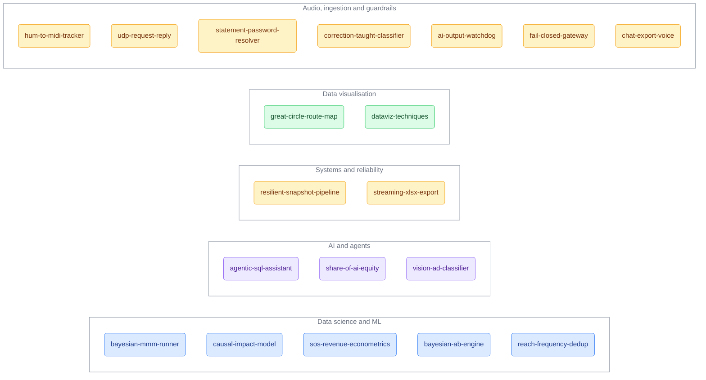

```
███████ ██   ██  ██████  ██     ██ ██████  ███████ ███████ ██
██      ██   ██ ██    ██ ██     ██ ██   ██ ██      ██      ██
███████ ███████ ██    ██ ██  █  ██ ██████  █████   █████   ██
     ██ ██   ██ ██    ██ ██ ███ ██ ██   ██ ██      ██      ██
███████ ██   ██  ██████   ███ ███  ██   ██ ███████ ███████ ███████
```

<p align="center"><b>Nineteen small engineering projects, each built to run on its own with a single command.</b></p>

<p align="center">
  
  
  
  
  
  
  
</p>

Every project takes a real problem, keeps the part that is actually interesting, and
ships with a demo you can run in about a minute. No accounts, no API keys, nothing to
sign up for. Everything runs offline on synthetic data.

## What is inside



## The projects

|   | Project | What it is | Built with | Try it |
|---|---------|------------|------------|--------|
| 📊 | [bayesian-mmm-runner](./bayesian-mmm-runner) | Works out how much each marketing channel actually drives sales, with honest uncertainty ranges, and suggests a better budget split | Python, Meridian | `python main.py --demo` |
| 🧪 | [causal-impact-model](./causal-impact-model) | Measures the true effect of an intervention by modelling what would have happened without it | Python, statsmodels | `python main.py --demo` |
| 📈 | [sos-revenue-econometrics](./sos-revenue-econometrics) | Tests whether brand demand sits on the path from spend to revenue, and with what time lag | Python, statsmodels | `python main.py --demo` |
| 🎲 | [bayesian-ab-engine](./bayesian-ab-engine) | An A/B test analyser that reports "B beats A with 92% probability" instead of a hard-to-read p-value | TypeScript | `npm run demo` |
| 📡 | [reach-frequency-dedup](./reach-frequency-dedup) | Counts how many real people an ad campaign reached without double-counting the overlap between channels | TypeScript | `npm run demo` |
| 🤖 | [agentic-sql-assistant](./agentic-sql-assistant) | An AI assistant that answers questions by writing and running its own database queries, behind a read-only guard | TypeScript | `npm run demo` |
| 🧠 | [share-of-ai-equity](./share-of-ai-equity) | Measures a brand's share of voice inside AI-generated answers, the new answer-engine visibility metric | Node.js | `npm run demo` |
| 🖼️ | [vision-ad-classifier](./vision-ad-classifier) | Sorts ad images by type, using an image model for the content and plain pixel maths for the format | Node.js | `npm run demo` |
| 🛡️ | [resilient-snapshot-pipeline](./resilient-snapshot-pipeline) | Keeps a dashboard from ever going blank when the data source it relies on is slow or flaky | TypeScript, SQLite | `npm run demo` |
| 📤 | [streaming-xlsx-export](./streaming-xlsx-export) | Streams huge spreadsheet exports without running out of memory, and blocks formula injection in cells | TypeScript | `npm run demo` |
| 🗺️ | [great-circle-route-map](./great-circle-route-map) | A world map with curved flight routes, drawn entirely by hand in SVG with no mapping library | React, Vite | `npm run dev` |
| 🎨 | [dataviz-techniques](./dataviz-techniques) | Three reusable chart techniques: a masked confidence band, a diverging heatmap scale, and an SVG gauge | React, Recharts | `npm run dev` |
| 🎤 | [hum-to-midi-tracker](./hum-to-midi-tracker) | Turns a hummed melody into real MIDI notes — pitch tracking, note segmentation and humane quantisation, from scratch | Python, numpy | `python main.py --demo` |
| 📻 | [udp-request-reply](./udp-request-reply) | Builds request/response conversations on top of a fire-and-forget UDP protocol, including shared-port correlation | Python | `python main.py --demo` |
| 🔐 | [statement-password-resolver](./statement-password-resolver) | Derives the formulaic passwords banks lock PDF statements with — one audit point, candidates tried in order, plaintext never persisted | Python | `python main.py --demo` |
| 🎓 | [correction-taught-classifier](./correction-taught-classifier) | A classifier that learns from human corrections immediately — retrieval with a similarity floor, cache-aware prompt injection, no retraining | Python | `python main.py --demo` |
| 🕰️ | [ai-output-watchdog](./ai-output-watchdog) | A deterministic nightly auditor for a generative system's pipelines — and the rule that silence is not failure | Python | `python main.py --demo` |
| 🚦 | [fail-closed-gateway](./fail-closed-gateway) | Rate limiting and moderation for a paid LLM endpoint where a guard outage never becomes free compute | Node.js | `npm run demo` |
| 🗣️ | [chat-export-voice](./chat-export-voice) | Extracts only the human's messages from ChatGPT/Claude/generic chat exports and distils how they actually write | Node.js | `npm run demo` |

## A bit more on each

### Data science and ML

**📊 bayesian-mmm-runner.** A marketing mix model. It reads years of weekly spend and sales,
estimates the return on each channel as a credible range rather than a single false-precision
number, then recommends how to rebalance the budget. The part worth reading is what makes a
research library behave safely in production.

**🧪 causal-impact-model.** Estimates the real effect of an intervention (a campaign starting, a
channel going dark) by modelling the counterfactual: what the metric would have done if nothing
had changed. It tries three modelling backends in turn and falls all the way back to a structural
time-series estimator written from scratch, so it still works with only a basic stats install.

**📈 sos-revenue-econometrics.** A classic econometrics pipeline that asks whether a brand-demand
signal sits between marketing spend and revenue, and how long the effect takes. Granger causality,
a vector auto-regression with automatic lag selection, and impulse-response curves with
bootstrapped confidence bands.

**🎲 bayesian-ab-engine.** A Bayesian take on A/B testing. It reports the probability that one
option beats another, and the expected cost of choosing wrong, both far easier to act on than a
p-value. The statistics are written from scratch with no libraries.

**📡 reach-frequency-dedup.** Advertising reach is not additive, because audiences overlap. This
estimates the real de-duplicated reach and average frequency, and wraps the slow calculation in a
cache that answers instantly while it refreshes in the background.

### AI and agents

**🤖 agentic-sql-assistant.** Ask a question in plain English and it decides which database queries
to run, runs them, and answers. The core is a strict guard that lets only read-only queries
through, plus caching that never serves a stale live number.

**🧠 share-of-ai-equity.** As people ask AI assistants "which product should I pick", this measures
how often and how prominently a brand appears in those answers, ranked by where it shows up and
backed by the answer's citations. A brand-visibility metric for the answer-engine era.

**🖼️ vision-ad-classifier.** It classifies ad creatives by what they say, using a vision model, and
by what format they are, using exact pixel dimensions. The demo shows why the split matters: the
pixel-based format stays stable across runs while the model guess wobbles.

### Systems and reliability

**🛡️ resilient-snapshot-pipeline.** When the upstream source is slow and only returns part of the
data, this keeps the dashboard showing the last complete picture instead of a broken, half-empty
one. Built after a real incident where a single line of SQL blanked a live dashboard.

**📤 streaming-xlsx-export.** Exports very large datasets to Excel by streaming rows straight to the
response instead of building the whole file in memory, so it never runs out of memory, and it
neutralises spreadsheet formula injection in every cell, a risk most exporters miss.

### Data visualisation

**🗺️ great-circle-route-map.** A map with curved flight paths, built entirely by hand in SVG. The
projection, the curves, and the little plane that points along the route are all done from first
principles, with no mapping library.

**🎨 dataviz-techniques.** Three small, reusable visualisation techniques shown side by side: a
confidence band faked with layer compositing (something the charting library cannot do natively), a
diverging colour scale anchored on a live midpoint, and a probability gauge drawn as a single SVG
arc.

## Running any project

Each folder is self-contained.

TypeScript and Node projects:

```bash
cd <project>
npm install && npm run demo
```

Python projects (`bayesian-mmm-runner`, `causal-impact-model`, `sos-revenue-econometrics`,
`hum-to-midi-tracker` — the rest of the Python projects are stdlib-only, no install):

```bash
cd <project>
pip install -r requirements.txt && python main.py --demo
```

Web apps (`great-circle-route-map`, `dataviz-techniques`): `npm install && npm run dev`.

## Notes

Every data source in this repo is synthetic, and every outside service is faked behind a clean
interface, so everything runs offline with no credentials and no private data. Licensed under
[MIT](./LICENSE).
